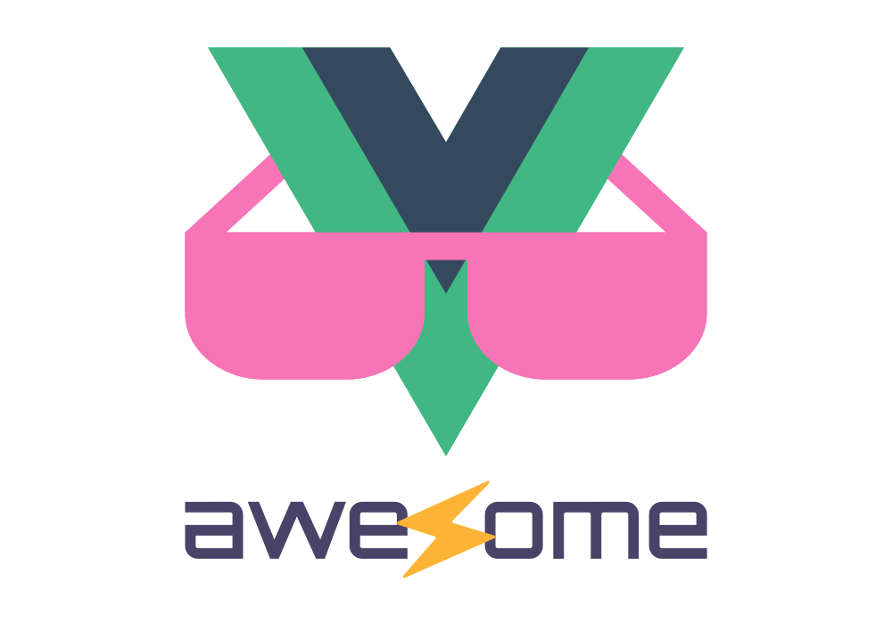

<!--lint disable awesome-heading awesome-github awesome-toc double-link -->

   
  
   
   

<h2 align='center'>Awesome Vite.js</h2>

A curated list of awesome things related to <a href='https://github.com/vitejs/vite'>Vite.js</a>
  

<!--lint ignore-->

## Table of Contents

Use the "Table of Contents" menu on the top-left corner to explore the list.

## Resources

### Official Resources

- [Documentation](https://vitejs.dev/)
- [GitHub Repo](https://github.com/vitejs/vite)
- [Release Notes](https://github.com/vitejs/vite/blob/main/packages/vite/CHANGELOG.md)
- [Vue 3 Docs](https://vuejs.org/)
- [Awesome Vue](https://github.com/vuejs/awesome-vue)
- [Migration from v2](https://vitejs.dev/guide/migration.html)

<!--### Tutorials-->

## Get Started

- [create-vite](https://github.com/vitejs/vite/tree/main/packages/create-vite) - Scaffolding Your First Vite Project.
- [create-vitawind](https://github.com/huibizhang/vitawind/tree/package/create-vitawind) - Scaffolding for TailwindCSS project.
- [create-electron-vite](https://github.com/electron-vite/create-electron-vite) - Scaffolding Your Electron + Vite Project.
- [create-vite-app](https://github.com/ErKeLost/create-vite-app) - Scaffolding Your Out Of The Box Vite Project.

### Templates

#### Vanilla

- [vite-vanilla-tailwind-v3](https://github.com/huibizhang/template-vite-vanilla-tailwind-v3) - Starter template for Tailwindcss and prettier-plugin-tailwindcss build-in.
- [vite-vanilla-ts-lib-starter](https://github.com/kbysiec/vite-vanilla-ts-lib-starter) - Starter for library (CJS, ESM, IIFE) with TypeScript, ESLint, Stylelint, Prettier, Jest, Husky + lint-staged.
- [vite-tailwind-nojs-starter](https://github.com/kometolabs/vite-tailwind-nojs-starter) - NoJS Tailwind CSS starter template.
- [vite-tailwind-stimulus-starter](https://github.com/jeremyfrank/vite-tailwind-stimulus-starter) - Starter template for Tailwind CSS and Stimulus controllers.

#### Vue 3

- [Vitesse](https://github.com/antfu/vitesse) - Opinionated starter template.
- [vite-vue3-tailwind-starter](https://github.com/web2033/vite-vue3-tailwind-starter) - Vue 3, Vue Router and Tailwind CSS.
- [vite-ts-tailwind-starter](https://github.com/Uninen/vite-ts-tailwind-starter) - TypeScript, Tailwind CSS, Cypress.io e2e tests + CI.
- [vue-vben-admin](https://github.com/anncwb/vue-vben-admin) - Background management template based on Vue3, Ant-Design-Vue, TypeScript.
- [vue-pure-admin](https://github.com/xiaoxian521/vue-pure-admin) - Background management template based on Vue3, TypeScript, Tailwind CSS, element-plus.
- [fast-crud](https://github.com/fast-crud/fast-crud) - Options-oriented crud framework, developing crud as fast as lightning.
- [vivu](https://github.com/logustra/vivu) - Opinionated scalable vue boilerplate.
- [vite-tauri-template](https://github.com/yooneskh/vite-tauri-template) - Tauri + Vite + Vue 3 + Vuetify 3 desktop app template.
- [vue-vite-h5](https://github.com/LZHD/vue-vite-h5) - Use Vue3, TypeScript and Vant to develop mobile applications.
- [Vitesome](https://github.com/alvarosaburido/vitesome) - Vue3 + TypeScript + WindiCSS + Vue Router 4, i18n and Iconify.
- [vitesse-lite](https://github.com/antfu/vitesse-lite) - Lightweight version of Vitesse.
- [vitesse-webext](https://github.com/antfu/vitesse-webext) - WebExtension Vite Starter Template.
- [vite-ts-vue3-todo](https://github.com/nabaonan/todos-action/tree/master/vue-vite-ts-setup) - Vue3 + TS + Vue-Router4 + Pinia2 template.
- [naive-ui-dashboard-template](https://github.com/Innei/naive-ui-dashboard-template) - UI friendly, Vue 3 + TSX + TailwindCSS 2 JIT + PostCSS + Naive UI.
- [vitailse](https://github.com/zynth17/vitailse) - Like Vitesse but with Tailwind CSS.
- [vitespa](https://github.com/ctholho/vitespa) - Vitesse-based SPA without SSG.
- [vite-quasar-starter](https://github.com/fyeeme/vite-quasar) - Vite 2.x + Vue 3.x + quasar 2.x starter.
- [vue3-mobile-template](https://github.com/parajs/vue3-mobile-template) - Vue3 + TS + Vue-Router4 + Vuex4 + Vant + Vue-use + Vue-i18n Mobile Template.
- [vue3-template](https://github.com/lecoueyl/vue3-template) - Vue 3 / Tailwind CSS / vue-router / PNPM / ESlint Airbnb / Stylelint / GitHub pages actions / Netlify.
- [Modern Vue](https://github.com/byoungd/modern-vue-template) - Modern Vue stack 2022.
- [Vitecamp](https://github.com/nekobc1998923/vitecamp) - Vue3 / Element Plus / Axios / Vue Router / Pinia / Windi CSS / icones / i18n / Markdown / Svg / ESLint Airbnb Style / Components and APIs auto importing.
- [vite-vue3-typescript-webcomponent](https://github.com/skysign/vite-vue3-typescript-webcomponent) - Vue 3 / Typescript / boiler plate to develop Web Component.
- [vite-vue-ts-storybook](https://github.com/Miguel-Bento-Github/vite-vue-ts-storybook) - Vue 3 / i18n / Typescript / Vite / Storybook / ESLint / Prettier.
- [vite-vue-tailwind-v3](https://github.com/huibizhang/template-vite-vue-tailwind-v3) - Starter template for Vue3 + TailwindCSS and `prettier-plugin-tailwindcss` build-in.
- [vite-vue-ts-tailwind-v3](https://github.com/huibizhang/template-vite-vue-ts-tailwind-v3) - Starter template for Vue3 + Typescript + TailwindCSS and `prettier-plugin-tailwindcss` build-in.
- [Vitawind Creator](https://vitawind.vercel.app/scaffolding/creator/) - Create TailwindCSS project rapidly.
- [vue3-ts-vite-vitest-todo](https://github.com/hefengxian/vue3-ts-vite-vitest-todo) - Vue 3 / TypeScript / Vite / Vitest with full tests / Composition API / Pure TS/TSX.
- [vue3-tailwind3-website-starter](https://github.com/feitian124/vue3-tailwind3-website-starter.git) - Vue3 / Vite / TailwindCSS website starter template, with guides on each page.
- [vite-boot](https://github.com/kirklin/vite-boot) - Vite + Vue3 + TypeScript + Vue-Router4 + Pinia + Tailwind CSS + VueUse Template.
- [Vue Naive](https://github.com/zclzone/vue-naive-admin) - Admin template, base on Vue 3 + Pinia + Naive UI.
- [vue-admin-box](https://github.com/cmdparkour/vue-admin-box) - Admin template, based on Vue 3 + Element-plus.
- [vivu-npm](https://github.com/logustra/vivu-npm) - Starter template to build component library.
- [vue3-pc-template](https://github.com/parajs/vue3-pc-template) - Vite + ElementPlus + Vue3 + TS + Vue-Router4 + Vuex4 + Vue-use + Vue-i18n PC Template.
- [ViTauri](https://github.com/NicolaSpadari/vitauri) - Vite + Tauri + Vue3 + TS + Vue-Router4 + Auto imports.
- [vue-hbs-admin](https://github.com/developer-plus/vue-hbs-admin) - Admin starter template based on `Vite` + `Vue3` + `TypeScript` + `Vue-Router4` + `Pinia` + `Unocss` + `Ant-design-vue` + `Auto imports`.
- [vite-vue-proste](https://github.com/xyhxx/vite-vue-proste) - Pinia + Typescript + Vue-Router4 + Vitest + Vue-Test-Utils + Vue-Query + Sass + ESLint + Stylelint + Prettier + `project presets`.
- [vue-vite-ssr](https://github.com/EverSeenTOTOTO/browser-app-boilerplate/tree/vue-vite-ssr) - Typescript, Eslint, Stylelint, Husky, Lint-staged and Commitlint.
- [vue3-vant-mobile](https://github.com/CharleeWa/vue3-vant-mobile) - Vite + Vue3 + Vant4 + Pinia + Vue-Router4 + TypeScript Mobile Template.
- [vue3-powerbuild](https://github.com/UIC-Group/vue3-powerbuild) - Vue 3 + TypeScript + Tailwind CSS + Vite + Storybook + ESLint + Prettier.
- [vue-ts-starter](https://github.com/yugasun/vue-ts-starter) - Vue3 + TypeScript + Vite + Pinia.
- [vitequality](https://github.com/cstuncsik/vitequality) - Vue 3 + Typescript + Vue Router + Pinia + Eslint + Jest + Cypress.
- [vue-vite-tw-ts](https://github.com/ChronosMasterOfAllTime/vue-vite-tw-ts) - Vue 3 + Vite + Vitest + Cypress E2E + Naive UI + Pinia + Vue Router.
- [vite-vue-box](https://github.com/NelsonYong/vite-vue-box) -  Vite + Vue 3 + Ts + TailWindCss + VueHook Plus + Pinia + Axios + ESLint + Stylelint.
- [vite-vue-js-starter-template](https://github.com/ElanYoung/vite-vue-js-starter-template) - Vite + Vue3 + JavaScript + Vue Router + Pinia + TDesign + ESLint + Stylelint + Prettier Simple Template.

#### Vue 2

- [vite-vue2-windicss-starter](https://github.com/lstoeferle/vite-vue2-windicss-starter) - Vue 2, Vue Router, Composition API, VueUse, Windi CSS and TypeScript.
- [vite-ts-vue2-todo](https://github.com/nabaonan/todos-action/tree/master/vue2-vite-ts) - Vue2 + ts + Vue-Router3 + Pinia1 + Composition API.
- [vite-vue2-ts-starter](https://github.com/logue/vite-vue2-ts-starter) - Vue2 TypeScript startar template using vue-property-decorator, vue-router, Vuex.
- [vite-vue2-ts-vuetify-starter](https://github.com/logue/vite-vue2-vuetify-ts-starter) - It is the above vite-vue2-ts-starter with Vuetify and its optimized settings. Includes basic templates.
- [vite-vue2-ts-template-starter](https://github.com/Luncode/vite-vue2-ts-template-starter) - Vite + Vue2 + Typescript + Vuex + Vue-router + Axios + Sass Simple Template.
- [vitify-admin](https://github.com/kingyue737/vitify-admin) - Vuetify admin starter template with full TypeScript support and intellisense of Vuetify components.
- [vite-vue2-js-starter-template](https://github.com/ElanYoung/vite-vue2-js-starter-template) - Vite + Vue2 + JavaScript + Vue Router + Vuex + Axios + Less + ESLint + Stylelint + Prettier Simple Template.

#### React

- [Vitamin](https://github.com/wtchnm/Vitamin) - React TypeScript, TailwindCSS, SPA + PWA, Cypress and CI.
- [vite-reactts-eslint-prettier](https://github.com/TheSwordBreaker/vite-reactts-eslint-prettier) - React, TypeScript, ESlint, Prettier, Pre-commit.
- [react-vite-admin](https://github.com/ychengcloud/react-vite-admin) - React, Recoil, React Query, React Hooks, TypeScript, Axios.
- [vite-template-react](https://github.com/SafdarJamal/vite-template-react) - A Create React App-like template.
- [vitejs-template-react-rescript](https://github.com/jihchi/vitejs-template-react-rescript) - React + ReScript.
- [template-vite-react](https://github.com/lzm0x219/template-vite-react) - A minimal React Vite starter template.
- [reactjs-vite-tailwindcss-boilerplate](https://github.com/joaopaulomoraes/reactjs-vite-tailwindcss-boilerplate) - React 18, TypeScript, Jest, Testing Library, TailwindCSS 3, Eslint and Prettier.
- [Tropical](https://github.com/bensmithett/tropical) - React, Storybook, MDX, Fela, SSR prerendering, and [islands architecture](https://www.npmjs.com/package/tropical-islands).
- [vite-plugin-react-refresh](https://github.com/fengxinming/vite-plugins/tree/main/packages/vite-plugin-react-refresh) - Provide enhancements for [@vitejs/plugin-react-refresh](https://www.npmjs.com/package/@vitejs/plugin-react-refresh).
- [vite-reactts17-chakra-jest-husky](https://github.com/The24thDS/vite-reactts17-chakra-jest-husky) - React 17, TypeScript, Chakra UI, Jest, ESLint, Prettier, Husky.
- [react-ts-vite-template](https://github.com/fabien-ml/react-ts-vite-template) - React, TypeScript, Jest, Testing Library, Cypress, ESLint, Prettier, Husky.
- [vite-reactts-tailwind-rtk-eslint](https://github.com/IsaiaPhiliph/vite-reactts-tailwind-rtk-eslint) - React, TypeScript, Tailwind CSS, Redux Toolkit, eslint.
- [vite-react-tailwind-template](https://github.com/Innei/vite-react-tailwind-template) - React 17, TypeScript, Jest, ESLint, Prettier, Husky, Tailwind CSS, PostCSS, pnpm.
- [stravital](https://github.com/rizkimcitra/stravital) - TypeScript, Git Hooks, Commitizen, Lint Staged, TailwindCSS.
- [vite-react-ts-tailwind-firebase-starter](https://github.com/TeXmeijin/vite-react-ts-tailwind-firebase-starter) - Starter using Vite + React + TypeScript + Tailwind CSS (daisyUI) + Firebase (v9) + Prettier + ESLint.
- [vite-react-ts-starter](https://github.com/uchihamalolan/vite-react-ts) - React, TypeScript, Jest, ESLint, Prettier, TailwindCSS, Husky, Conventional Commits.
- [vital](https://github.com/jvidalv/vital) - React, TypeScript, Tailwind (JIT), CSS-Modules, Jest, Atomic Design, Prettier, Husky, Commit-lint.
- [vite-react-ts-ghactions-template](https://github.com/pchmn/vite-react-ts-ghactions-template) - React, TypeScript, Vitest + React Testing Library, GitHub Actions + GitHub Pages, ESLint, Prettier, Husky, Commitlint.
- [vite-react-tailwind-v3](https://github.com/huibizhang/template-vite-react-tailwind-v3) - Starter template for React + TailwindCSS and `prettier-plugin-tailwindcss` build-in.
- [vite-react-ts-tailwind-v3](https://github.com/huibizhang/template-vite-react-ts-tailwind-v3) - Starter template for React + Typescript + TailwindCSS and `prettier-plugin-tailwindcss` build-in.
- [vite-react-ts-extended](https://github.com/laststance/vite-react-ts-extended) - React, TypeScript, TailwindCSS, MSW, Axios, Jest, React Testing Library, ESLint, Prettier, GitHub Actions.
- [vite-react-starter](https://github.com/fabgrel10/vite-react-starter) - React + ESLint + Prettier + SASS + Emotion + TailwindCSS + Jest + Testing Library.
- [chrome-extension-boilerplate-react-vite](https://github.com/Jonghakseo/chrome-extension-boilerplate-react-vite) - React + TypeScript + SASS + Prettier + ESLint + GitHub Actions + Chrome Extension Manifest v3.
- [vite-ant-design-pro](https://github.com/1247748612/vite-ant-design-pro) - React + antd + ProComponents + ReactQuery + ReactRouter6.
- [vite-rtk-query](https://github.com/laststance/vite-rtk-query) - React, TypeScript, Redux Toolkit, RTK Query, TailwindCSS, MSW, Jest, React Testing Library, ESLint, Prettier.
- [vite-react-proste](https://github.com/xyhxx/vite-react-proste) - React + TypeScript + `react-router-dom` + Recoil + SASS + Testing Library + `react-query` + ESLint + Stylelint + Prettier.
- [React-PWA](https://github.com/suren-atoyan/react-pwa) - React v18, TypeScript, Vite, React Router v6, MUI v5, Recoil, PWA, Eslint, Prettier, Husky, lint-staged, https localhost and more.
- [vite-react-ts-minimal-template](https://github.com/alessandropisu/vite-react-ts-minimal-template) - React + TypeScript + Airbnb ESLint + Prettier + Husky.
- [react-vite-ssr](https://github.com/EverSeenTOTOTO/browser-app-boilerplate/tree/react-vite-ssr) - Mobx, Typescript, Eslint, Stylelint, Husky, Lint-staged and Commitlint.
- [Viact](https://github.com/MR-Mostafa/Viact) - React + TypeScript + ESLint + Prettier + Support RTL + mock REST API Viact + Storybook, ErrorBoundary, UnoCss and more.
- [Viterts](https://github.com/erdoganbulut/viterts/) - React + TypeScript + Redux + React Router + Jest + ESLint + Airbnb + Prettier + SASS.
- [ViteRC](https://github.com/potreco/viterc) - React 18 + TypeScript + ESLint (Airbnb) + Prettier + Husky + Jest + Absolute imports + Commit linting.
- [VRTTV](https://github.com/Drumpy/vrttv-boilerplate) - React + TypeScript + TailwindCSS + ESLint + Prettier + Husky + Conventional Commits + Gitmoji + GitHub Actions + Vercel Deploy.
- [React Starter Kit](https://github.com/kriasoft/react-starter-kit) - Jamstack, React, React Router, Material UI, Firebase Auth, TypeScript, ESLint, Prettier, Jest, GitHub Actions.
- [vite-mern-template](https://github.com/apicgg/vite-mern-template) - React 18 + TypeScript + Vite + Redux Toolkit + ESLint + React Router DOM + Axios + React Icons + React Toastify + Express + Mongoose.
- [react-pipeline](https://github.com/maifeeulasad/react-pipeline) - React 18 + TS + AntD + GitHub Pages + Tailwind + Sass + React Router DOM + ESLint.
- [Varsarr](https://github.com/altmshfkgudtjr/varsarr) - React, Typescript, Styled-Components, Recoil, React-Query, Axios, Absolute imports.
- [viterjs-template](https://github.com/emre-cil/viterjs-template) - React + JavaScript + Redux + Material UI + Axios + ESLint + Prettier.
- [react-vite-ts-boilerplate](https://github.com/choisohyun/react-vite-ts-boilerplate) - React 18, TypeScript, SCSS, ESLint, Prettier, Vitest.
- [vite-react-universal-template](https://github.com/laoer536/vite3.0-react18-TypeScript-router-dom6-mobx6-Eslint-prettier-template) - React18 + TypeScript + `react-router-dom` + Mobx + ESlint + Prettier+Husky, and APIs auto importing.
- [vite-reactts18-eslint-tailwindcss](https://github.com/dserranoc/vite-reactts18-eslint-tailwindcss) - React 18 + TypeScript + ESLint + TailwindCSS.

#### Svelte

- [SvelteKit](https://github.com/sveltejs/kit) - The fastest way to build Svelte apps.
- [sttv](https://github.com/srmullen/sttv) - Svelte, Tailwind CSS, TypeScript.
- [svelte-vite-ssr](https://github.com/jiangfengming/svelte-vite-ssr) - Svelte with SSR support.

#### Electron

- [electron-vite-vue](https://github.com/electron-vite/electron-vite-vue) - Electron + Vite + Vue template.
- [electron-vite-react](https://github.com/electron-vite/electron-vite-react) - Electron + Vite + React template.
- [electron-vite-boilerplate](https://github.com/electron-vite/electron-vite-boilerplate) - Support SerialPort, SQLite3 and node C/C++ addons.
- [electron-vite-quick-start](https://github.com/yingpengsha/electron-vite-quick-start) - Full stack uses Vite to run Electron application, including main process.
- [electron-vite-template](https://github.com/umbrella22/electron-vite-template) - Electron 13, Vue 3 and TypeScript. Make your desktop development easier.
- [fast-vite-electron](https://github.com/ArcherGu/fast-vite-electron) - Vue3 + Vite + Electron with esbuild.
- [fast-vite-nestjs-electron](https://github.com/ArcherGu/fast-vite-nestjs-electron) - Vue3 + Vite + Electron + Nestjs with esbuild.
- [vite-plugin-electron-quick-start](https://github.com/electron-vite/vite-plugin-electron-quick-start) - Template for Electron projects.
- [vite-electron-builder](https://github.com/cawa-93/vite-electron-builder/) - Electron apps using Vite for both back and front-end, with automatic releases.
- [vite-reactts-electron-starter](https://github.com/maxstue/vite-reactts-electron-starter) - React, Tailwind CSS, TypeScript and Electron.
- [Vitectron](https://github.com/hyroge/vitectron) - TypeScript & JSX + Vue 3.x + Vite 2.x + Pinia 2.x + Vue-Router 4.x.
- [vite-plugin-electron-renderer](https://github.com/electron-vite/vite-plugin-electron-renderer) - Support use Node.js API in Electron-Renderer.
- [electron-vue-template](https://github.com/Deluze/electron-vue-template) - Electron template with TypeScript, including Electron Builder.
- [Vitron](https://github.com/tada5hi/vitron) - Build beautiful (win, linux, mac) desktop apps for modern web projects with vite and electron.

#### Elm

- [vite-elm-template](https://github.com/lindsaykwardell/vite-elm-template) - A default template for building Elm applications.
- [elm_vite_tailwind_template](https://github.com/gacallea/elm_vite_tailwind_template) - Opinionated template for building Elm web apps using Tailwind CSS and Daisy UI.
- [vite-elm-spa](https://github.com/lindsaykwardell/vite-elm-spa) - An unopinionated template for building Elm single page applications.

#### Petite-Vue

- [vite-petite-vue-starter](https://github.com/misitebao/vite-petite-vue-starter) - Starter template.

#### Others

- [P5.js Starter Template](https://github.com/makinteract/p5js-vite) - Templates for creating P5.js sketches.
- [vit-singlefile-gzip](https://github.com/MillerRen/vite-singlefile-gzip.git) - Starter template for embedded.
- [11st-Starter-Kit](https://github.com/stefanfrede/11st-starter-kit) - 11ty, powered by Vite with Tailwind CSS and Alpine.js.
- [chrome-ext-template-preact-windi-vite](https://github.com/fell-lucas/chrome-ext-template-preact-windi-vite) - Preact, Windi CSS, TypeScript, Prettier, ESLint, GitHub Actions and Chrome Extension Manifest v3.

## Plugins

### Framework-agnostic Plugins

#### Integrations

- [@vitejs/plugin-legacy](https://github.com/vitejs/vite/tree/main/packages/plugin-legacy) - Legacy browser support.
- [vite-plugin-pwa](https://github.com/antfu/vite-plugin-pwa) - Zero-config PWA.
- [vite-plugin-windicss](https://github.com/windicss/vite-plugin-windicss) - Windi CSS integration.
- [vite-plugin-node](https://github.com/axe-me/vite-plugin-node) - Integration with Node.js backend servers.
- [vite-plugin-cesium](https://github.com/nshen/vite-plugin-cesium) - Integration with Cesium library.
- [vite-plugin-mpa](https://github.com/IndexXuan/vite-plugin-mpa) - Out-of-box multi-page application (MPA) integration.
- [vite-plugin-linter](https://bitbucket.org/unimorphic/vite-plugin-linter) - Extensible linter framework that shows the linting output in the Vite output and the browser console, includes ESLint & TypeScript ootb.
- [vite-plugin-checker](https://github.com/fi3ework/vite-plugin-checker) - Fast run checkers (TypeScript/VLS/vue-tsc, etc.) in worker threads with overlay and terminal hint.
- [@nabla/vite-plugin-eslint](https://github.com/nabla/vite-plugin-eslint) - Runs ESLint asynchronously in a worker to keep HMR fast.
- [vite-plugin-tauri](https://github.com/amrbashir/vite-plugin-tauri) - Integrate Tauri in a Vite project to build cross-platform apps.
- [vite-plugin-federation](https://github.com/originjs/vite-plugin-federation) - Support Module Federation, Inspired by Webpack Module Federation feature.
- [vite-plugin-wasm-pack](https://github.com/nshen/vite-plugin-wasm-pack) - Integration with rust [wasm-pack](https://github.com/rustwasm/wasm-pack), the simple way.
- [vite-plugin-comlink](https://github.com/mathe42/vite-plugin-comlink) - Use WebWorkers with the power of [Comlink](https://github.com/GoogleChromeLabs/comlink) to make them enjoyable.
- [vite-plugin-sass-dts](https://github.com/activeguild/vite-plugin-sass-dts) - This is a plugin that automatically creates a type file when using the CSS module type-safely.
- [vite-esbuild-typescript-checker](https://github.com/time4dev/vite-esbuild-typescript-checker) - Type checker (TypeScript, Vue SFC, etc.) based on the webpack 5 plugin.
- [vite-plugin-simple-gql](https://github.com/alansikora/vite-plugin-simple-gql) - Easily import .graphql and .gql files.
- [vite-plugin-ali-oss](https://github.com/xiaweiss/vite-plugin-ali-oss) - Upload the production files bundled in the project to Ali OSS, except for HTML.
- [vite-plugin-webfont-dl](https://github.com/feat-agency/vite-plugin-webfont-dl) - Downloads and injects webfonts (Google Fonts) to improve website's performance.
- [vite-plugin-babel](https://github.com/owlsdepartment/vite-plugin-babel) - Babel integration for both build and server to support f.ex. decorators or class fields in pure JS/JSX files.
- [vite-plugin-resolve](https://github.com/vite-plugin/vite-plugin-resolve) - Custom resolve module content.
- [vite-plugin-electron](https://github.com/electron-vite/vite-plugin-electron) - Integrate Vite and Electron.
- [vite-plugin-optimizer](https://github.com/vite-plugin/vite-plugin-optimizer) - Manually Pre-Bundling.
- [vite-plugin-dynamic-import](https://github.com/vite-plugin/vite-plugin-dynamic-import) - Enhance Vite builtin dynamic import.
- [vite-plugin-esmodule](https://github.com/vite-plugin/vite-plugin-esmodule) - Build ES module to CommonJs module for Node.js.
- [vite-plugin-dynamic-import-module](https://github.com/Dunqing/vite-plugin-dynamic-import-module) - Support for dynamic import module with variables.
- [vite-plugin-mp](https://github.com/zhuweiyou/vite-plugin-mp) - Configure multi-pages applications and code splitting.
- [vite-plugin-babel-compiler](https://github.com/yzydeveloper/vite-plugin-babel-compiler) - The plugin works with Babel compiler.
- [vite-plugin-commonjs](https://github.com/vite-plugin/vite-plugin-commonjs) - A pure JavaScript implementation for CommonJs.
- [vite-plugin-mpa-plus](https://github.com/yzydeveloper/vite-plugin-mpa-plus) - More flexible MPA (multi-page application) supports html templates, path rewriting.
- [vite-plugin-tencent-oss](https://github.com/taosiqi/vite-plugin-tencent-oss) - Upload the production files bundled in the project to Tencent OSS, except for HTML.
- [vite-plugin-multi-pages](https://github.com/Miofly/vite-plugin-multi-pages) - Multi Pages Support，can build src/pages anyPage，can set prefixName.
- [vite-plugin-html-template-mpa](https://github.com/Miofly/vite-plugin-html-template-mpa) - Multi Pages Common template support.
- [vite-plugin-vconsole-mpa](https://github.com/Miofly/vite-plugin-vconsole-mpa) - Multi Pages Vconsole supports，simple config.
- [vite-plugin-browser-sync](https://github.com/Applelo/vite-plugin-browser-sync) - BrowserSync.
- [vite-plugin-jspm](https://github.com/jspm/vite-plugin-jspm) - Resolves dependencies independently from CDN providers using import maps and es-module-shims.
- [vite-plugin-print-urls](https://github.com/yzydeveloper/vite-plugin-print-urls) - Vite hmr and page reload will print server urls.
- [vite-plugin-env-switch](https://github.com/PengBoUESTC/vite-plugin-env-switch) - Switch project env and restart vite server without command line operation.
- [vite-plugin-msg-log](https://github.com/PengBoUESTC/vite-plugin-msg-log) - Log the msg you want to confirm frequently (like env info) when HMR.
- [vite-plugin-bullet-msg](https://github.com/PengBoUESTC/vite-plugin-bullet-msg) - Get the target strings in you source code and show them in browser(or handle them yourself).
- [vite-plugin-virtual-mpa](https://github.com/emosheeep/vite-plugin-virtual-mpa) - Out-of-box MPA plugin, with html template engine and virtual files support, which generate multiple files using only one template.
- [tailwindcss-vite-plugin](https://github.com/await-ovo/tailwindcss-webpack-plugin) - Tailwind CSS integration.
#### Loaders

- [unplugin-icons](https://github.com/antfu/unplugin-icons) - Access thousands of icons as components.
- [vite-plugin-rsw](https://github.com/lencx/vite-plugin-rsw) - Load rust-compiled (wasm-pack) WebAssembly packages.
- [vite-imagetools](https://github.com/JonasKruckenberg/vite-imagetools) - Load and transform images using url query parameters.
- [vite-plugin-radar](https://github.com/stafyniaksacha/vite-plugin-radar) - All in one analytics loader (with 7+ providers supported).
- [vite-plugin-monaco-editor](https://github.com/vdesjs/vite-plugin-monaco-editor) - Monaco Editor integration.
- [vite-plugin-image-presets](https://github.com/ElMassimo/vite-plugin-image-presets) - Define presets to automatically create and optimize responsive images.
- [vite-plugin-import-rewriter](https://github.com/yuexiaoliang/vite-plugin-import-rewriter) - Rewriter the import based on conditions.
- [vite-plugin-xml-loader](https://github.com/lorenzoc25/vite-plugin-xml-loader) - Loads xml file as JSON.
- [vite-plugin-glsl](https://github.com/UstymUkhman/vite-plugin-glsl) - Import shader file chunks.

#### Bundling

- [vite-plugin-importer](https://github.com/ajuner/vite-plugin-importer) - Integration for babel-plugin-import.
- [vite-plugin-banner](https://github.com/chengpeiquan/vite-plugin-banner) - Adds a banner to the top of each generated chunk.
- [rollup-plugin-critical](https://github.com/nystudio107/rollup-plugin-critical) - Generate critical CSS.
- [vite-plugin-dts](https://github.com/qmhc/vite-plugin-dts) - Generate declaration files from `.ts` or `.vue` source files for lib.
- [vite-compression-plugin](https://github.com/XeryYue/vite-compression-plugin) - Use Node.js stream compress file to gzip or more.
- [vite-plugin-chunk-split](https://github.com/sanyuan0704/vite-plugin-chunk-split) - Automatically code splitting, support unbundle in production.
- [vite-plugin-static-copy](https://github.com/sapphi-red/vite-plugin-static-copy) - Copy files and folders.
- [vite-plugin-copy-files](https://github.com/mistjs/vite-plugin-copy-files) - Move files to the location of the corresponding package directory.
- [vite-plugin-progress](https://github.com/jeddygong/vite-plugin-progress) - Display with progress bar when building.
- [vite-plugin-importus](https://github.com/Geocld/vite-plugin-importus) - Modularly import plugin, compatible with antd, lodash, material-ui and so on.
- [vite-plugin-build](https://github.com/samonxian/vite-plugin-build) - Transfom the whole folder in library mode.
- [vite-plugin-zip-file](https://github.com/Ssis53/vite-plugin-zip) - Compress files or folders into zip.
- [vite-plugin-zip-pack](https://github.com/7th-Cyborg/vite-plugin-zip-pack) - Pack distribution/build folder into a zip file.
- [vite-plugin-cp](https://github.com/fengxinming/vite-plugins/tree/main/packages/vite-plugin-cp) - Copy files after building bundles.

#### Transformers

- [vite-plugin-html](https://github.com/anncwb/vite-plugin-html) - Plugin to minimize and use ejs template syntax in `index.html`.
- [vite-plugin-ts-nameof](https://github.com/Shinigami92/vite-plugin-ts-nameof) - Ability to resolve [nameof](https://github.com/dsherret/ts-nameof) in TypeScript.
- [vite-plugin-handlebars](https://github.com/alexlafroscia/vite-plugin-handlebars) - Process HTML files with Handlebars.
- [vite-plugin-html-config](https://github.com/ahwgs/vite-plugin-html-config) - HTML tag configuration, such as script link style meta favicon and more.
- [vite-plugin-html-template](https://github.com/IndexXuan/vite-plugin-html-template) - HTML template, like `html-webpack-plugin` for Webpack.
- [vite-plugin-virtual-html](https://github.com/Windson1806/vite-plugin-virtual-html) - Make Vite MPA consistent with `@vue/cli`.
- [vite-plugin-require-context](https://github.com/originjs/vite-plugins/tree/main/packages/vite-plugin-require-context) - Supports `require.context`.
- [vite-plugin-commonjs](https://github.com/originjs/vite-plugins/tree/main/packages/vite-plugin-commonjs) - Support CommonJS to ESM.
- [vite-plugin-content](https://github.com/originjs/origin.js/tree/main/packages/vite-plugin-content) - Convert `yaml`, `xml`, `ini`, `toml`, `csv`, `plist` and `properties` files to ES6 modules.
- [vite-plugin-require](https://github.com/wangzongming/vite-plugin-require) - A Vite plugin that supports `require` by code transforming.
- [vite-plugin-global-style](https://github.com/originjs/origin.js/tree/main/packages/vite-plugin-global-style) - Deal with global styles for CSS, SASS, LESS and Stylus.
- [vite-plugin-shared-modules](https://github.com/zheeeng/vite-plugin-shared-modules) - Share node_modules in monorepos.
- [vite-plugin-require-transform](https://github.com/WarrenJones/vite-plugin-require-transform) - Converts the code from require syntax to import.
- [vite-plugin-twig](https://github.com/fiadone/vite-plugin-twig) - Twig template engine support.
- [vite-plugin-stache](https://github.com/pYr0x/vite-plugin-stache) - CanJS's template engine. Transforms `stache` files and template strings.
- [vite-plugin-pug-transformer](https://github.com/TheSeally/vite-plugin-pug-transformer) - Pug template engine support.
- [@import-meta-env/unplugin](https://github.com/iendeavor/import-meta-env) - Inject environment variables into the `import.meta.env` object after building the application instead of statically replacing it during production.
- [vite-plugin-load-css-module](https://github.com/jsonz1993/vite-plugin-load-css-module) - Support custom regexp of css modules and use vite internal css plugin, not just `.module.xxx`.
- [vite-plugin-remain-exports](https://github.com/coconilu/vite-plugin-remain-exports) - Remaining exports from the entry file that imported by html.
- [vite-plugin-unocss-to-uni](https://github.com/zguolee/vite-plugin-unocss-to-uni) - `UnoCSS` in `uni-app`.
- [@modyfi/vite-plugin-yaml](https://github.com/Modyfi/vite-plugin-yaml) - Transform YAML files to ESM with schema validation and error reporting.
- [vite-plugin-head](https://github.com/KesionX/vite-plugin-head) - Modify, add, delete `Metadata` in the head element.
- [vite-plugin-html-env](https://github.com/lxs24sxl/vite-plugin-html-env) - Injection of environment variables in `index.html`.
- [vite-plugin-html-inject](https://github.com/donnikitos/vite-plugin-html-inject) - Split the `index.html` into smaller reusable pieces.
- [vite-plugin-inject-preload](https://github.com/Applelo/vite-plugin-inject-preload) - Inject `<link rel="preload">` to your `index.html` based on your build assets.
- [vite-plugin-document](https://github.com/JiangWeixian/vite-plugin-document) - Use `Document.tsx` as html template.
- [@vituum/vite-plugin-handlebars](https://github.com/vituum/vite-plugin-handlebars) - Handlebars template engine support, transforms `.hbs` templates to `.html`.
- [@vituum/vite-plugin-pug](https://github.com/vituum/vite-plugin-pug) - Pug template engine support, transforms `.pug` templates to `.html`.
- [@vituum/vite-plugin-nunjucks](https://github.com/vituum/vite-plugin-nunjucks) - Nunjucks template engine support, transforms `.njk` templates to `.html`.
- [@vituum/vite-plugin-liquid](https://github.com/vituum/vite-plugin-liquid) - Liquid template engine support, transforms `.liquid` templates to `.html`.
- [@vituum/vite-plugin-twig](https://github.com/vituum/vite-plugin-twig) - Twig template engine support, transforms `.twig` templates to `.html`.
- [@vituum/vite-plugin-latte](https://github.com/vituum/vite-plugin-latte) - Latte template engine support, transforms `.latte` templates to `.html`.
- [@vituum/vite-plugin-posthtml](https://github.com/vituum/vite-plugin-posthtml) - PostHTML support, transforms syntax to `.html`.
- [@vituum/vite-plugin-juice](https://github.com/vituum/vite-plugin-juice) - Juice support, transforms `.css` to inline styles in `.html`.
- [vite-plugin-setting-css-module](https://github.com/ProgrameBoy/vite-plugin-setting-css-module) - Implementing CSS-Modules with vite modularity rules. Don't need create `xxx.module.css`.

#### Helpers

- [vite-tsconfig-paths](https://github.com/aleclarson/vite-tsconfig-paths) - Support for TypeScript's path mapping.
- [vite-plugin-theme](https://github.com/anncwb/vite-plugin-theme) - Dynamically changing the theme color.
- [vite-aliases](https://github.com/subwaytime/vite-aliases) - Alias auto-generation based on project structure.
- [vite-plugin-imp](https://github.com/onebay/vite-plugin-imp) - Import library component styles on demand, make your app slimmer.
- [vite-plugin-mkcert](https://github.com/liuweiGL/vite-plugin-mkcert) - Provide certificates https dev server.
- [vite-plugin-vconsole](https://github.com/vadxq/vite-plugin-vconsole) - Help developers use vconsole to facilitate mobile development and debugging.
- [vite-plugin-externals](https://github.com/crcong/vite-plugin-externals) - Exclude dependencies from the output bundles.
- [vite-plugin-mock-server](https://github.com/enjoycoding/vite-plugin-mock-server) - Mock server plugin, support using TS and JS to write Mock API and HMR.
- [vitawind](https://github.com/huibizhang/vitawind) - Install and Setting Tailwind CSS automatically.
- [vite-plugin-restart](https://github.com/antfu/vite-plugin-restart) - Restart the Vite server on file changes.
- [vite-plugin-full-reload](https://github.com/ElMassimo/vite-plugin-full-reload) - Reload the browser on file changes.
- [vite-plugin-tips](https://github.com/yingpengsha/vite-plugin-tips) - Provide better development server status tips on the page.
- [vite-plugin-external](https://github.com/fengxinming/vite-plugins/tree/main/packages/vite-plugin-external) - Provides a way of excluding dependencies from the runtime code and output bundles.
- [unplugin-auto-import](https://github.com/antfu/unplugin-auto-import) - On-demand API auto-importing.
- [vite-plugin-inspect](https://github.com/antfu/vite-plugin-inspect) - Inspect the intermediate state of Vite plugins.
- [@zougt/vite-plugin-theme-preprocessor](https://github.com/GitOfZGT/vite-plugin-theme-preprocessor) - Easily implementing dynamic themes based on LESS or SASS.
- [vite-plugin-remove-console](https://github.com/xiaoxian521/vite-plugin-remove-console) - A vite plugin that deletes console.log in the production environment.
- [vite-plugin-dev-manifest](https://github.com/owlsdepartment/vite-plugin-dev-manifest) - Generates `manifest.dev.json` during dev server, for backend integration with any language/framework.
- [vite-plugin-watch-and-run](https://github.com/jycouet/kitql/tree/main/packages/vite-plugin-watch-and-run) - Watch some files (glob) and trigger a command. To enable any tool to have a watch mode.
- [vite-plugin-dynamic-base](https://github.com/chenxch/vite-plugin-dynamic-base) - Resolve all resource files dynamic publicPath.
- [vite-plugin-redirect](https://github.com/ebeloded/vite-plugin-redirect) - Redirect server requests.
- [vite-plugin-live-reload](https://github.com/arnoson/vite-plugin-live-reload) - Live reloading.
- [vite-plugin-simple-vconsole](https://github.com/venojs/vite-plugin-simple-vconsole) - A debug console view inside your app to make mobile debugging easier, for both SPA and MPA.
- [vite-plugin-file-mock](https://github.com/venojs/vite-plugin-file-mock) - File system based local mock plugin.
- [vite-plugin-qrcode](https://github.com/svitejs/vite-plugin-qrcode) - Show QR code on server start.
- [vite-plugin-cem](https://github.com/Kamiapp-fr/vite-plugin-cem) - Generates `custom-elements.json` manifest for describing custom elements.
- [vite-plugin-web-update-notification](https://github.com/GreatAuk/plugin-web-update-notification) - Detect webpage updates and notify user to reload. support vite and umijs.
- [vite-plugin-autogeneration-import-file](https://github.com/yuntian001/vite-plugin-autogeneration-import-file) - Automatically generates import file.
- [vite-plugin-browserslist-useragent](https://github.com/kingyue737/vite-plugin-browserslist-useragent) - Compile browserslist query to a RegExp to test browser useragent.
- [vite-plugin-validate-env](https://github.com/Julien-R44/vite-plugin-validate-env) - Validate your environment variables at build time. Never forget an environment variable again.
- [vite-plugin-mock-data](https://github.com/fengxinming/vite-plugins/tree/main/packages/vite-plugin-mock-data) - Provides a simple way to mock data.
- [vite-plugin-reverse-proxy](https://github.com/fengxinming/vite-plugins/tree/main/packages/vite-plugin-reverse-proxy) - Sometimes we have to redirect scripts on production environment to debug and solve problems, the plugin will transform the script to be served with the `text/javascript` MIME type to `module` MIME type.
- [vite-plugin-patch-env](https://github.com/KeJunMao/vite-plugin-patch-env) - Patch environment variables from the system into Vite.
- [vite-plugin-conditional-compile](https://github.com/KeJunMao/vite-plugin-conditional-compile) - Conditional compilation syntax based on environment variables.

#### Testing

- [mocha-vite-puppeteer](https://github.com/larsthorup/mocha-vite-puppeteer) - Run your Mocha front-end tests with the Vite bundler and the Puppeteer browser launcher.
- [vitest](https://github.com/vitest-dev/vitest) - A Vite-native test framework.
- [vitest-mock-extended](https://github.com/eratio08/vitest-mock-extended) - Type safe mocking extensions for Vitest.

### Vue

[v23]: https://img.shields.io/badge/-2%2F3-3C8171
[v2]: https://img.shields.io/badge/-v2-42b883
[v3]: https://img.shields.io/badge/-v3-35495e

In this section, we use badges to indicate the targeted Vue version for each plugin.

![v2] for Vue 2 only, ![v3] for Vue 3 only, and ![v23] for plugins that compatible with both versions.

<!--lint ignore double-link-->

> 💡 SSR frameworks are listed at [SSR - Frameworks](#ssr).

<!--lint disable awesome-list-item-->

#### Integrations

- ![v3] [@vitejs/plugin-vue](https://github.com/vitejs/vite/tree/main/packages/plugin-vue) - Official Vue 3 support.
- ![v3] [@vitejs/plugin-vue-jsx](https://github.com/vitejs/vite/tree/main/packages/plugin-vue-jsx) - Official Vue 3 JSX support.
- ![v2] [vite-plugin-vue2](https://github.com/underfin/vite-plugin-vue2) - Vue 2 integration.
- ![v2] [unplugin-vue2-script-setup](https://github.com/antfu/unplugin-vue2-script-setup) - Enabling `<script setup>` syntax for Vue 2.

#### Routing

- ![v23] [vite-plugin-pages](https://github.com/hannoeru/vite-plugin-pages) - File system based route generator.
- ![v3] [v-route-generate](https://github.com/weiquanju/v-route-generate) - A tool to generate routes.

#### Loaders

- ![v23] [vite-plugin-md](https://github.com/antfu/vite-plugin-md) - Markdown as Vue components / Vue components in Markdown.
- ![v3] [vite-svg-loader](https://github.com/jpkleemans/vite-svg-loader) - Load SVG files as Vue components.
- ![v2] [vite-plugin-vue2-svg](https://github.com/pakholeung37/vite-plugin-vue2-svg) - Load SVG files as Vue components.

#### SSG

- ![v3] [vite-ssg](https://github.com/antfu/vite-ssg) - Server-side generation.

#### Ecosystem

- ![v3] [vite-plugin-vue-i18n](https://github.com/intlify/bundle-tools/tree/main/packages/vite-plugin-vue-i18n) - Integration for Vue I18n.
- ![v3] [vite-plugin-i18n-resources](https://github.com/fvena/vite-plugin-i18n-resources) - Load i18n translation message files.

#### Transformers

- ![v3] [vite-plugin-md-preview](https://github.com/JasKang/vite-plugin-md-preview) - Markdown code preview.

#### Helpers

- ![v23] [unplugin-vue-components](https://github.com/antfu/unplugin-vue-components) - On-demand components auto-importing.
- ![v3] [vite-plugin-vue-gql](https://github.com/wheatjs/vite-plugin-vue-gql) - GraphQL Tags for your Vue SFC.
- ![v2] [vite-plugin-vue2-suffix](https://github.com/williamyorkl/vite-plugin-vue2-suffix) - Compatible without '.vue' suffix.
- ![v23] [vite-plugin-vue-inspector](https://github.com/webfansplz/vite-plugin-vue-inspector) - Jump to local IDE source code while click the element of browser.
- ![v23] [vite-plugin-vue-static-sfc](https://github.com/arikw/vite-plugin-vue-static-sfc) - Serve ".vue" files as static assets.

<!--lint enable awesome-list-item-->

### React

#### Official

- [@vitejs/plugin-react](https://github.com/vitejs/vite/tree/main/packages/plugin-react) - The all-in-one Vite plugin for React projects.

#### Presets

- [vite-preset-react](https://github.com/puruvj/vite-preset-react) - All in one preset for your React app - HMR, Automatic React inject, removal of DevTools in prod.

#### Loaders

- [vite-plugin-svgr](https://github.com/pd4d10/vite-plugin-svgr) - Transform SVGs into React components.

#### Transformers

#### Framework

- [vite-plugin-react-pages](https://github.com/vitejs/vite-plugin-react-pages) - A Vite framework for building React app.
- [@vitjs/vit](https://github.com/vitjs/vit) - React application framework inspired by UmiJS.

#### Helpers

- ![v1718] [vite-plugin-react-inspector](https://github.com/sudongyuer/vite-plugin-react-inspector) - Jump to local IDE source code while click the element of browser.

<!--lint ignore double-link-->

> 💡 SSR frameworks are listed at [SSR - Frameworks](#ssr).

### Svelte

#### Integrations

- [vite-plugin-svelte](https://github.com/sveltejs/vite-plugin-svelte) - Adds Svelte support. Official plugin of Svelte team.

### Solid

#### Integrations

- [vite-plugin-solid](https://github.com/amoutonbrady/vite-plugin-solid) - Provides JSX transformation for Solid.

### Elm

#### Integrations

- [vite-plugin-elm](https://github.com/hmsk/vite-plugin-elm) - A plugin that enables you to compile an Elm module.

### Angular

#### Integrations

- [@nxext/angular-vite](https://github.com/nxext/nx-extensions/tree/main/packages/angular/vite) - A plugin that uses SWC to compile Angular modules.

### Electron

#### Integrations

- [electron-vite](https://github.com/alex8088/electron-vite) - An Electron CLI integrated with Vite.

#### Presets

- [vite-plugin-electron-config](https://github.com/alex8088/vite-plugin-electron-config) - Electron plugin for Vite, support for main process, renderer process and preload script.

### Rollup Plugins

- [Vite Rollup Plugins](https://vite-rollup-plugins.patak.dev/) - Compatibility list for official rollup plugins.

#### Included in Vite

- [@rollup/plugin-alias](https://github.com/rollup/plugins/blob/master/packages/alias) - Define and resolve aliases for bundle dependencies.
- [@rollup/plugin-commonjs](https://github.com/rollup/plugins/blob/master/packages/commonjs) - Convert CommonJS modules to ES6.
- [@rollup/plugin-dynamic-import-vars](https://github.com/rollup/plugins/blob/master/packages/dynamic-import-vars) - Resolving dynamic imports that contain variables.
- [@rollup/plugin-json](https://github.com/rollup/plugins/blob/master/packages/json) - Convert `.json` files to ES6 modules.

#### Covered by default in Vite

- [@rollup/plugin-babel](https://github.com/rollup/plugins/tree/master/packages/babel) - Compile your files with Babel.
- [@rollup/plugin-buble](https://github.com/rollup/plugins/tree/master/packages/buble) - Compile ES2015 with buble.
- [@rollup/plugin-data-uri](https://github.com/rollup/plugins/tree/master/packages/data-uri) - Import modules from Data URIs.
- [@rollup/plugin-html](https://github.com/rollup/plugins/tree/master/packages/html) - Create HTML files to serve Rollup bundles.
- [@rollup/plugin-node-resolve](https://github.com/rollup/plugins/tree/master/packages/node-resolve) - Locate and bundle third-party dependencies in node_modules.
- [@rollup/plugin-sucrase](https://github.com/rollup/plugins/tree/master/packages/sucrase) - Compile TypeScript, Flow, JSX, etc with Sucrase.
- [@rollup/plugin-typescript](https://github.com/rollup/plugins/tree/master/packages/typescript) - Integration between Rollup and TypeScript.
- [@rollup/plugin-wasm](https://github.com/rollup/plugins/tree/master/packages/wasm) - Import WebAssembly code with Rollup.
- [@rollup/plugin-url](https://github.com/rollup/plugins/tree/master/packages/url) - Import files as data-URIs or ES Modules.

#### Compatible with Vite

- [@rollup/plugin-beep](https://github.com/rollup/plugins/tree/master/packages/beep) - System beeps on errors and warnings.
- [@rollup/plugin-dsv](https://github.com/rollup/plugins/blob/master/packages/dsv) - Convert `.csv` and `.tsv` files into JavaScript modules with d3-dsv.
- [@rollup/plugin-eslint](https://github.com/rollup/plugins/blob/master/packages/eslint) - Verify entry point and all imported files with ESLint.
- [@rollup/plugin-graphql](https://github.com/rollup/plugins/blob/master/packages/graphql) - Convert .gql/.graphql files to ES6 modules.
- [@rollup/plugin-image](https://github.com/rollup/plugins/blob/master/packages/image) - Import JPG, PNG, GIF, SVG, and WebP files (needs `enforce: 'pre'`).
- [@rollup/plugin-inject](https://github.com/rollup/plugins/blob/master/packages/inject) - Scan modules for global variables and injects import statements where necessary.
- [@rollup/plugin-legacy](https://github.com/rollup/plugins/tree/master/packages/legacy) - Add export declarations to legacy non-module scripts.
- [@rollup/plugin-replace](https://github.com/rollup/plugins/tree/master/packages/replace) - Replace strings in files while bundling.
- [@rollup/plugin-strip](https://github.com/rollup/plugins/tree/master/packages/strip) - Remove debugger statements and functions from your code.
- [@rollup/plugin-virtual](https://github.com/rollup/plugins/blob/master/packages/virtual) - A Rollup plugin that loads virtual modules from memory.
- [@rollup/plugin-yaml](https://github.com/rollup/plugins/blob/master/packages/yaml) - Convert YAML files to ES6 modules.
- [rollup-plugin-graphql-codegen](https://github.com/rxliuli/liuli-tools/tree/master/libs/rollup-plugin-graphql-codegen) - Generating type definitions for GraphQL tag template strings in worker_threads.
- [rollup-plugin-i18next-dts-gen](https://github.com/rxliuli/liuli-tools/tree/master/libs/rollup-plugin-i18next-dts-gen) - Generating type definitions from i18n JSON files are used for code hinting and validation.

#### Community

- Check the [Awesome Rollup list](https://github.com/rollup/awesome) for community-maintained rollup plugins, and refer to the Vite docs section about [rollup plugin compatibility](https://vitejs.dev/guide/api-plugin.html#rollup-plugin-compatiblity).

## SSR

[react]: https://img.shields.io/badge/-React-4ab2cf
[vue2]: https://img.shields.io/badge/-Vue%202-42b883
[vue3]: https://img.shields.io/badge/-Vue%203-42b883
[svelte]: https://img.shields.io/badge/-Svelte-db552a

<!--lint disable awesome-list-item-->

### Libraries

- [vite-ssr](https://github.com/frandiox/vite-ssr) - Simplified Server Side Rendering with an SPA-like developer experience. ![react] ![vue3]
- [vite-plugin-ssr](https://vite-plugin-ssr.com) - Like Nuxt/Next.js but as a do-one-thing-do-it-well plugin. ![react] ![vue3] ![vue2] ![svelte]
- [ssr](https://github.com/zhangyuang/ssr) - A Server Side Rendering framework combined with Webpack/Vite. ![react] ![vue3] ![vue2]
- [vavite](https://github.com/cyco130/vavite) - A tool for developing and building server-side applications with live reloading capabilities.

### Frameworks

- [vitedge](https://github.com/frandiox/vitedge) - Edge-side rendering with fullstack utilities. ![react] ![vue3]
- [vitext](https://github.com/aslemammad/vitext) - The Next.js like React framework for better User & Developer experience. ![react]
- [Rakkas](https://github.com/rakkasjs/rakkasjs) - React framework inspired by Next.js and SvelteKit. ![react]

<!--lint enable awesome-list-item-->

## Integrations with Backends

### Adobe Experience Manager

- [AEM Vite](https://github.com/aem-vite/aem-vite) - Integration for Adobe Experience Manager and AEM SDK.

### Craft CMS

- [Craft Vite](https://github.com/nystudio107/craft-vite) - Plugin for integration with Craft CMS.

### Django

- [django-vite](https://github.com/MrBin99/django-vite) - Integration for Django applications.

### Flask

- [Flask-Vite](https://pypi.org/project/flask-vite/) - Integration with Flask.

### Ruby on Rails

- [vite-plugin-ruby](https://github.com/ElMassimo/vite_ruby/tree/main/vite-plugin-ruby) - Configuration for Ruby backends.
- [Vite Ruby](https://github.com/ElMassimo/vite_ruby) - Integration for Rails, Hanami, Padrino, and Rack apps.

### Laravel

- [Laravel Vite](https://github.com/innocenzi/laravel-vite) - Integration for the Laravel framework.
- [Laravel Livewire Plugin](https://github.com/def-studio/vite-livewire-plugin) - Enable hot reloading of Laravel Livewire components without losing state.

### CakePHP

- [cakephp-vite](https://github.com/passchn/cakephp-vite) - Integration for CakePHP.

### WordPress

- [wordpress-vite-assets](https://github.com/idleberg/php-wordpress-vite-assets) - Integration for WordPress themes.

### Go

- [vite-go](https://github.com/torenware/vite-go) - Integration for Golang web apps.

### Rust

- [create-rust-app](https://github.com/Wulf/create-rust-app) - Integration for Rust web apps.

### OctoberCMS

- [Vitewind](https://github.com/chkilel/vitewind-theme) - Integration for OctoberCMS.

### Symfony

- [Vite Bundle](https://github.com/lhapaipai/vite-bundle) - Integration for Symfony.

### Shopify

- [vite-plugin-shopify](https://github.com/barrel/barrel-shopify/tree/main/packages/vite-plugin-shopify) - Integration for Shopify themes.

### CodeIgniter

- [codeigniter-vite](https://github.com/firtadokei/codeigniter-vitejs) - Integration for CodeIgniter.

### DDEV

- [ddev-viteserve](https://github.com/torenware/ddev-viteserve) - Add-on for running Vite in the PHP-oriented dev environment DDEV.

## Migrations

### Vue CLI

- [vue-cli-plugin-vite](https://github.com/IndexXuan/vue-cli-plugin-vite) - Use Vite on Vue CLI with minimize codebase modifications.
- [webpack-to-vite](https://github.com/originjs/webpack-to-vite) - Convert a webpack project to vite project, also provides conversion details to help you migrate smoothly.

### React

- [CRA migration guide](https://github.com/nordcloud/pat-frontend-template/blob/master/docs/CRA_MIGRATION_GUIDE.md) - A step-by-step guide for migrating a project from Create React App.

## Projects Using Vite.js

### Open Source

- [VitePress](https://github.com/vuejs/vitepress) - Static Site Generator powered by Vite and Vue.
- [TroisJS](https://github.com/troisjs/trois) - Three.js integration with Vite and Vue 3.
- [Slidev](https://github.com/slidevjs/slidev) - Presentation Slides for Developers.
- [îles](https://github.com/ElMassimo/iles) - Islands of Interactivity with Vue3, multi-framework.
- [Astro](https://github.com/withastro/astro) - Modern Static Site Builder.
- [Hathora](https://github.com/hathora/hathora) - Multiplayer game framework.
- [Nhost](https://github.com/nhost/nhost) - Nhost is an Open Source Firebase Alternative with GraphQL.
- [Ladle](https://github.com/tajo/ladle) - Tool for developing and testing component stories powered by Vite and React.
- [IslandJS](https://github.com/sanyuan0704/island.js) - Static site generator base on islands architecture.
- [Vituum](https://github.com/vituum/vituum) - Wrapper around Vite with predefined config, integrations and template engines.

### Apps/Websites

- [Icônes](https://github.com/antfu/icones) - Icon explorer with instant search.
- [Awesome CN Café](https://github.com/antfu/awesome-cn-cafe-web) - Web application for Awesome CN Café.
- [Todo Example](https://github.com/beary/vite-example) - Todo app with routing and state management.
- [npmview](https://github.com/pd4d10/npmview) - A web application to view npm package files.
- [Layoutit Grid](https://github.com/Leniolabs/layoutit-grid) - Interactive CSS Grid layout generator.
- [aitrack.work](https://aitrack.work) - A task-based time tracker for everyday use.
- [macOS in Svelte](https://github.com/PuruVJ/macos-web/) - macOS Desktop experience for Web in Svelte.
- [vue3-realworld-example-app](https://github.com/mutoe/vue3-realworld-example-app) - Realworld app implementation using Vue 3 + TypeScript + Composition API.
- [react-device-frameset](https://github.com/zheeeng/react-device-frameset) - This is yet another device frameset component for React.
- [vite-vue3-lowcode](https://github.com/buqiyuan/vite-vue3-lowcode) - Low code platform using Vue 3 + TypeScript + Composition API.
- [Context Note](https://github.com/betterRunner/context-note) - A note-taking chrome extension built by Vue3 & Vite.
- [Preview.js](https://previewjs.com) - An IDE extension to instantly preview React, Vue 2 and Vue 3 components.
- [react-keyboard-navigator](https://github.com/zheeeng/react-keyboard-navigator) - A suite of React components and hook for selecting from sibling components through the keyboard.
- [pointer-lock-movement](https://github.com/zheeeng/pointer-lock-movement) - A pointer lock movement manager for customizing your own creative UI.
